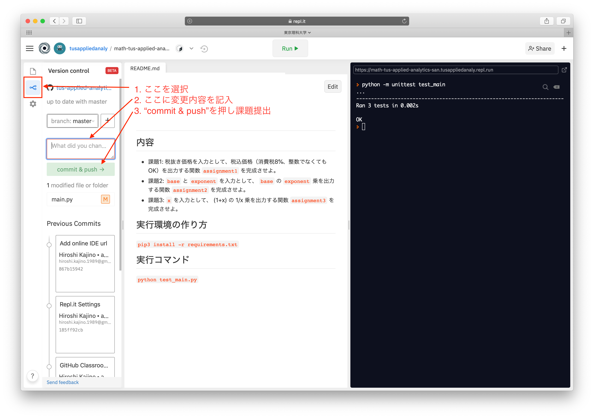
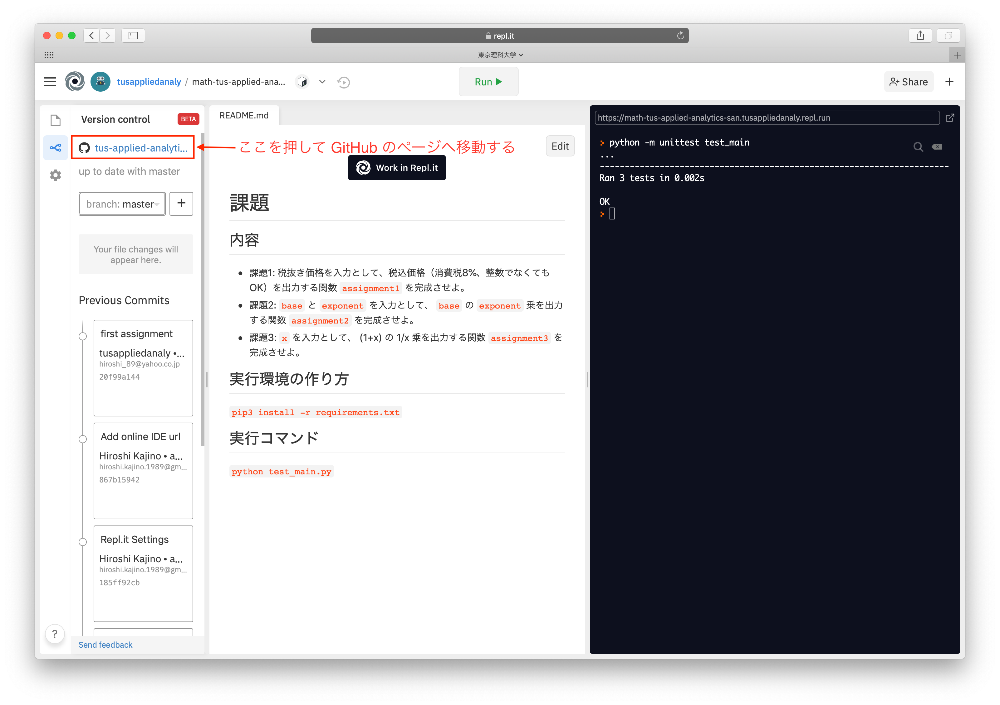
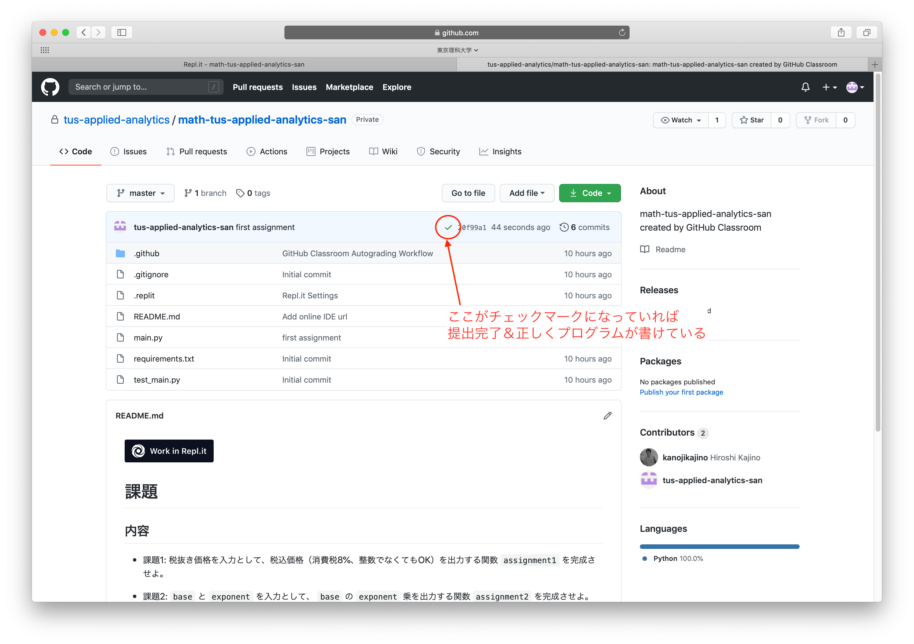

# 課題
GitHub Classroom での課題提出を一通りやってみよう

## 内容

1. `main.py` を開く
1. `return "Hello!"`と書かれている箇所を `return "Hello world!"` と書き換える
1. 上の "Run" と書かれたボタンを押し、右の黒い画面（コンソール）に `OK` と出るのを確認する
1. 以下の手順にしたがって課題を提出する

1. 課題のページへ移動する

1. 課題が提出できているか、正しく解答できているかを確認する
   - ここがバツになっている場合は、課題が提出できていないか解答が正しくないかのいずれか
   - 右の時間（下図で 44 seconds ago と書いてある箇所）が課題提出時間に対応しているならば、課題は提出できているので、解答が誤りである可能性が高い
   - この時間が課題提出時間に対応していないならば、課題が提出できていない可能性が高い

## 実行環境の作り方
`pip3 install -r requirements.txt`

## 実行コマンド
`python3 test_main.py`
